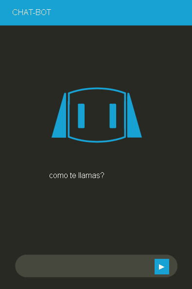

# CHATBOT CON PYHTON

<a href="https://tomvargas.github.io/CHATBOT/"><svg xmlns="http://www.w3.org/2000/svg" x="0px" y="0px" width="16" height="16" viewBox="0 0 172 172" style=" fill:#000000;"><g fill="none" fill-rule="nonzero" stroke="none" stroke-width="1" stroke-linecap="butt" stroke-linejoin="miter" stroke-miterlimit="10" stroke-dasharray="" stroke-dashoffset="0" font-family="none" font-weight="none" font-size="none" text-anchor="none" style="mix-blend-mode: normal"><path d="M0,172v-172h172v172z" fill="none"></path><g><path d="M9.675,13.975h152.65v144.05h-152.65z" fill="#333333"></path><path d="M161.25,15.05v141.9h-150.5v-141.9h150.5M163.4,12.9h-154.8v146.2h154.8v-146.2z" fill="#3498db"></path><path d="M8.6,12.9h154.8v25.8h-154.8z" fill="#3498db"></path><path d="M73.22484,122.87812l21.51671,-58.06132l4.03204,1.49422l-21.51671,58.06132z" fill="#ffffff"></path><path d="M59.985,116.96l-25.585,-22.36l25.585,-22.36l2.795,3.225l-21.93,19.135l21.93,19.135zM112.23,117.175l-2.795,-3.225l21.715,-19.135l-21.715,-19.35l2.795,-3.225l25.37,22.575z" fill="#ffffff"></path></g></g></svg>code</a>

## Descripción
Este programa de python con la libreria chatterbot emplea una simple interfaz por el cual el usuario hace  una entrada y el bot escoge la mejor respuestaposible para mostrar a travéz de un Label.

## Captura de pantalla

### sigueme en github >> 

<a href="https://github.com/Tomvargas">
  
  Tomvargas</a>

#

<a href="https://icons8.com/icon/63777/github">icons by Icons8</a>
